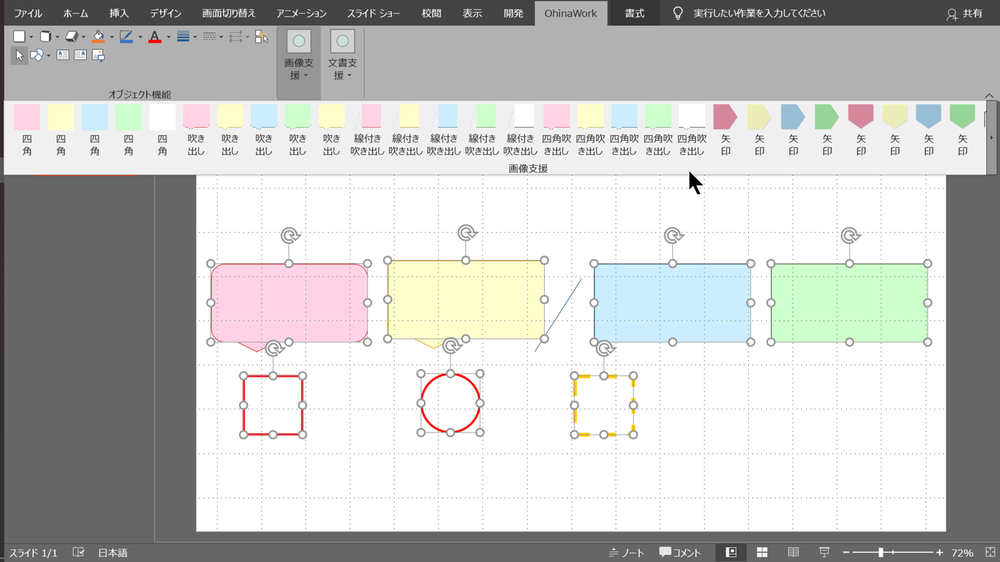

# OhinaWork

## OhinaWorkとは

PowerPoint用の作成を補助するVBAのアドインです。

---

## 機能

以下の機能を提供します。

### 雛形オートシェイプの挿入

雛形として用意している赤、青、黄、緑色のオートシェイプを挿入できます。

### PowerPointファイルの暗号化

パワーポイントファイルに任意のパスワードを設定することが可能です。

--

## インストール

pptx配下の以下のスクリプトをダブルクリックで実行することで、本ツールがインストールされます。

`installPowerPointAddin.vbs`

インストール後にPowerPointを起動すると、リボンタブにOhinaWorkというタブが追加されます。

## 補足

Word版もありますが、こちらに対する開発は終了させていただいております。
