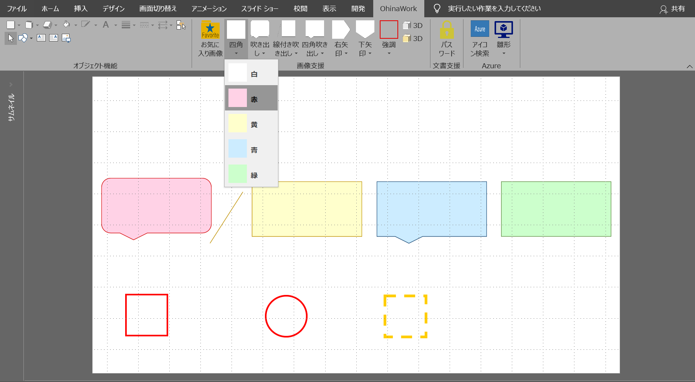
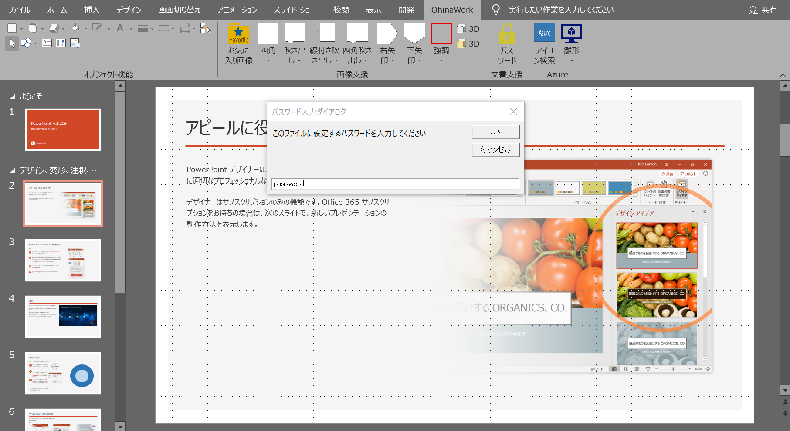

# OhinaWork


## OhinaWorkとは

PowerPointでのドキュメントの作成を補助するVBA製のアドインです。

---

## 履歴

* 2016年01月 : 初回作成
* 2019年03月 : 諸事情により、別のリポジトリに変更
* 2020年02月 : リポジトリをPublicに変更
* 2020年04月 : Azureアイコンセット挿入機能を追加
* 2020年05月 : AWSアイコンセット挿入機能を追加

## 機能

以下の機能のような機能を提供します。

### お気に入り画像の挿入

お気に入りフォルダに配置されている画像ファイルを入力フォーム上から挿入する機能です。


### 雛形オートシェイプの挿入

雛形として用意している白、赤、青、黄、緑色のオートシェイプを挿入できます。



### PowerPointファイルの暗号化

PowerPoint形式のファイルに任意のパスワードを設定することが可能です。



### Azureアイコンセットの挿入

Microsoft社が提供しているAzureアイコンセットを入力フォーム上から挿入する機能です。


### AWSアイコンセットの挿入

Amazon社が提供しているAWSアイコンセットを入力フォーム上から挿入する機能です。


---

## 動作環境

* Windos 8、Windows 10
* Microsoft Office 2016

## インストール

* 本リポジトリのdownloadボタンからファイルをダウンロードします

* ダウンロードしたファイルを解凍します

* pptxフォルダ配下の以下のスクリプトをダブルクリックします

`installPowerPointAddin.vbs`

インストール後にPowerPointを起動すると、リボンタブにOhinaWorkというタブが追加されます。

## アンインストール

* 本リポジトリのdownloadボタンからファイルをダウンロードします

* ダウンロードしたファイルを解凍します

* pptxフォルダ配下の以下のスクリプトをダブルクリックします

`unInstallPowerPointAddin.vbs`

アンインストール後にPowerPointを起動すると、リボンタブにOhinaWorkというタブが削除されます。

---

## 補足

wordフォルダ配下にWord版もありますが、こちらに対する開発は終了させていただいております。

pptxと同様に、``installWordAddin.vbs``を実行するとインストールされます。

---

## 製作者連絡先

ご意見、不具合などあれば、下記までご連絡下さい。

* 製作者名 : Ohina
* メールアドレス : `11ohina017@gmail.com`
* ブログ : https://ohina.work/post/about/

気に入った方はAmazonギフト件などで、カンパ(投げ銭)などしていただけると幸いです。
* [Amazonギフト券](https://www.amazon.co.jp/Amazon%E3%82%AE%E3%83%95%E3%83%88%E5%88%B8-1_JP_Email-Amazon%E3%82%AE%E3%83%95%E3%83%88%E5%88%B8-E%E3%83%A1%E3%83%BC%E3%83%AB%E3%82%BF%E3%82%A4%E3%83%97-Amazon%E3%83%99%E3%83%BC%E3%82%B7%E3%83%83%E3%82%AF/dp/B004N3APGO/ref=lp_3131877051_1_1?s=gift-cards&ie=UTF8&qid=1580641772&sr=1-1)

---

## ライセンス

当ソフトはフリーソフトウェアですが、
同梱されているアイコンセットについては、提供先のベンダが著作権を所持しています。


### Azureアイコンセットのライセンス

同梱されているAzureのアイコンについては著作権はMicrosoft社が所持しており、
ライセンスはMITライセンスとなります。

```
The MIT License (MIT)
Copyright (c) Microsoft Corporation

Permission is hereby granted, free of charge, to any person obtaining a copy of this software and
associated documentation files (the "Software"), to deal in the Software without restriction,
including without limitation the rights to use, copy, modify, merge, publish, distribute, sublicense,
and/or sell copies of the Software, and to permit persons to whom the Software is furnished to do so,
subject to the following conditions:

The above copyright notice and this permission notice shall be included in all copies or substantial
portions of the Software.

THE SOFTWARE IS PROVIDED "AS IS", WITHOUT WARRANTY OF ANY KIND, EXPRESS OR IMPLIED, INCLUDING BUT
NOT LIMITED TO THE WARRANTIES OF MERCHANTABILITY, FITNESS FOR A PARTICULAR PURPOSE AND NONINFRINGEMENT.
IN NO EVENT SHALL THE AUTHORS OR COPYRIGHT HOLDERS BE LIABLE FOR ANY CLAIM, DAMAGES OR OTHER LIABILITY,
WHETHER IN AN ACTION OF CONTRACT, TORT OR OTHERWISE, ARISING FROM, OUT OF OR IN CONNECTION WITH THE
SOFTWARE OR THE USE OR OTHER DEALINGS IN THE SOFTWARE.
```
https://www.microsoft.com/en-us/download/details.aspx?id=41937

Microsoft社ライセンスの詳細については同梱されている``pptx\img\azure-icons\LICENSE-CODE``をご参照下さい。

### AWSアイコンセットの挿入

AWSのアイコンセットについては、ライセンスの記載はありませんが、
以下のURLの記載に従って利用しています。

https://aws.amazon.com/jp/architecture/icons/?nc1=h_ls
